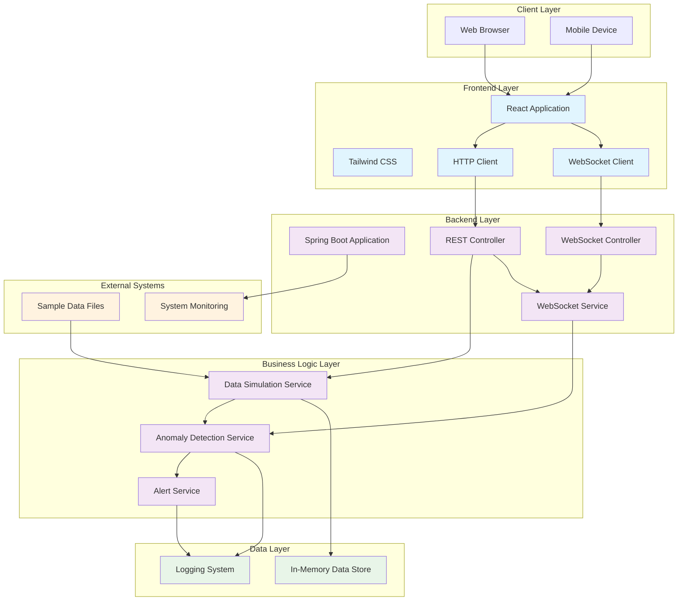
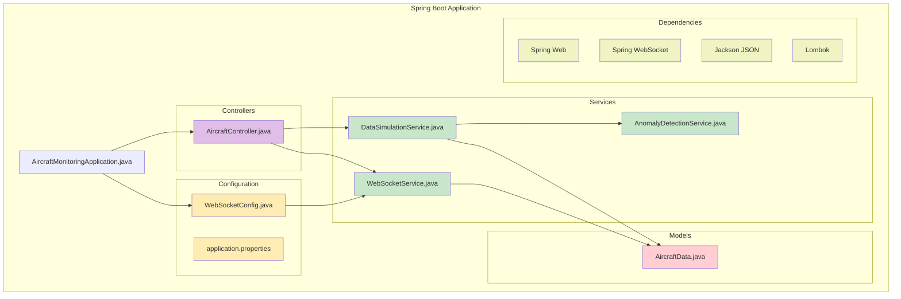
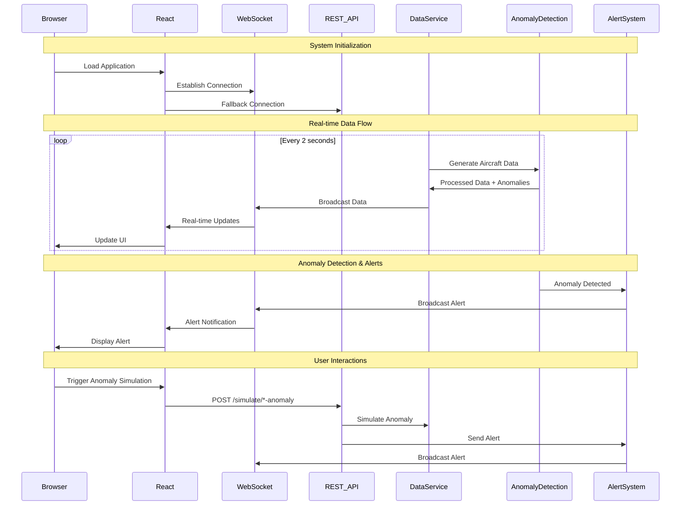
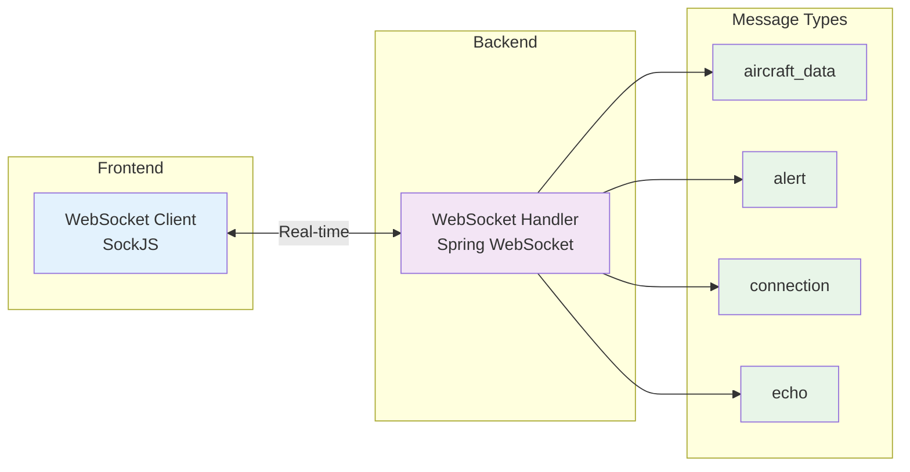
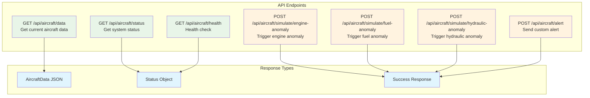
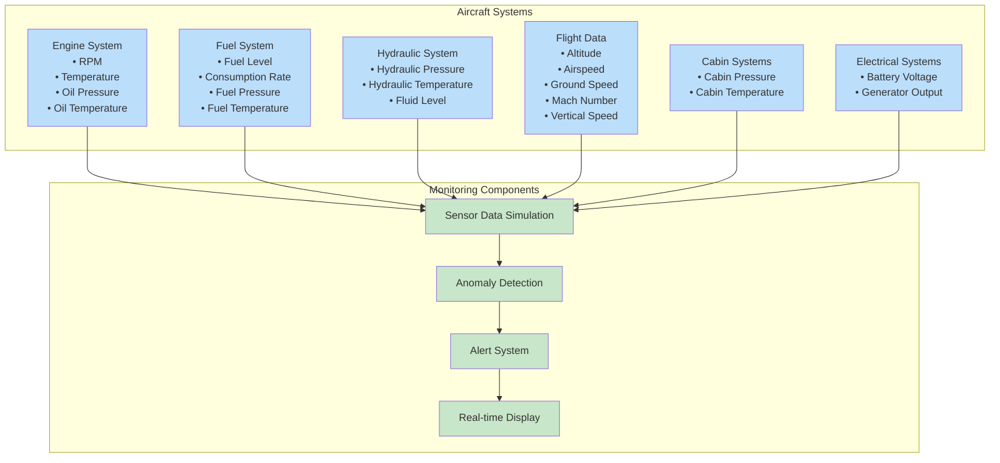
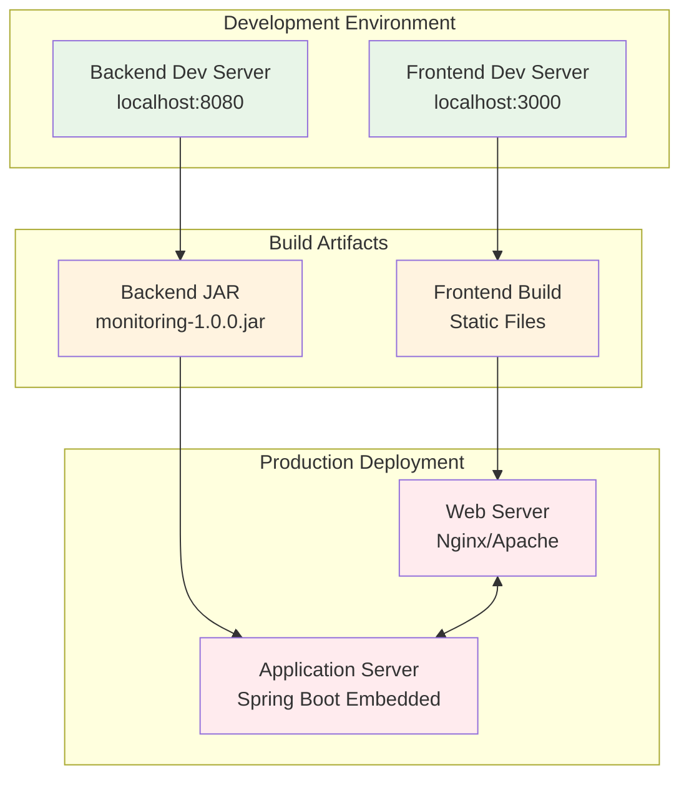

# Aircraft Health Monitoring System - Architecture Documentation

## Overview

The Aircraft Health Monitoring System is a real-time monitoring solution designed to track critical aircraft systems and detect anomalies. The system follows a modern microservices architecture with a clear separation between frontend and backend components.

## High-Level Architecture



## System Components

### Frontend Layer (React/TypeScript)

```mermaid
graph LR
    subgraph "React Application"
        APP[App.js]
        DASH[Dashboard.js]
        
        subgraph "System Components"
            ENG[EngineSystem.js]
            FUEL[FuelSystem.js]
            HYD[HydraulicSystem.js]
            FLIGHT[FlightData.js]
        end
        
        subgraph "UI Components"
            STATUS[SystemStatus.js]
            ALERT[AlertPanel.js]
            CONTROLS[AnomalyControls.js]
        end
        
        subgraph "Services"
            WS_SRV[WebSocketService.js]
        end
        
        subgraph "Styling"
            CSS[App.css]
            TAILWIND[Tailwind Config]
        end
    end
    
    APP --> DASH
    DASH --> ENG
    DASH --> FUEL
    DASH --> HYD
    DASH --> FLIGHT
    DASH --> STATUS
    APP --> ALERT
    DASH --> CONTROLS
    APP --> WS_SRV
    APP --> CSS
    CSS --> TAILWIND
    
    classDef component fill:#bbdefb
    classDef service fill:#c8e6c9
    classDef style fill:#fff9c4
    
    class ENG,FUEL,HYD,FLIGHT,STATUS,ALERT,CONTROLS component
    class WS_SRV service
    class CSS,TAILWIND style
```

### Backend Layer (Spring Boot/Java)



## Data Flow Architecture



## Communication Protocols

### WebSocket Communication



### REST API Endpoints



## Aircraft Systems Monitoring



## Technology Stack

### Frontend Technologies
- **React 18.2.0**: Component-based UI library
- **Tailwind CSS 3.3.0**: Utility-first CSS framework
- **SockJS Client 1.6.1**: WebSocket communication with fallback
- **Lucide React**: Modern icon library
- **Recharts 2.7.2**: Data visualization (if needed)

### Backend Technologies
- **Spring Boot 3.2.0**: Application framework
- **Spring WebSocket**: Real-time communication
- **Jackson**: JSON processing
- **Lombok**: Code generation for reducing boilerplate
- **OpenCSV 5.8**: CSV file processing
- **Java 17**: Programming language

### Development & Build Tools
- **Maven**: Backend dependency management and build
- **npm**: Frontend package management
- **PostCSS**: CSS processing
- **Autoprefixer**: CSS vendor prefixing

## Deployment Architecture



## Security Considerations

- **CORS Configuration**: Configured for development (allow all origins)
- **WebSocket Security**: SockJS with origin validation
- **Input Validation**: Server-side validation for API endpoints
- **Error Handling**: Comprehensive error handling and logging

## Scalability Features

- **Stateless Backend**: RESTful API design for horizontal scaling
- **WebSocket Broadcasting**: Efficient message distribution to multiple clients
- **In-Memory Data**: Fast data access for real-time requirements
- **Modular Architecture**: Easy to extend with new aircraft systems

## Monitoring & Observability

- **Application Logging**: Comprehensive logging with different levels
- **Health Endpoints**: Built-in health check endpoints
- **Connection Monitoring**: Real-time connection status tracking
- **Alert System**: Configurable alert notifications

## Future Enhancements

1. **Database Integration**: Persistent data storage for historical analysis
2. **Authentication & Authorization**: User management and role-based access
3. **Advanced Analytics**: Machine learning for predictive maintenance
4. **Mobile Application**: Native mobile app for field technicians
5. **External System Integration**: Integration with actual aircraft systems
6. **Data Export**: Export capabilities for compliance and reporting

This architecture provides a solid foundation for real-time aircraft health monitoring with room for future enhancements and scaling.
